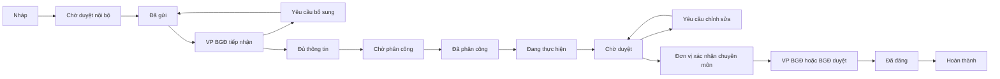

# BDU Media — Quản lý và điều phối truyền thông nội bộ

Ứng dụng Laravel + MySQL, giao diện Blade/CSS/JavaScript tiếng Việt. Mã nguồn Laravel nằm ngay ở thư mục gốc, cùng cấp với `artisan` và `composer.json`. Tài nguyên giao diện phục vụ trực tiếp từ `public/`, không cần npm/Vite để chạy ứng dụng.

## Đưa lên hosting: cấu hình .env rồi chạy lệnh

Mã nguồn đã được gom về thư mục gốc. Hosting cần PHP 8.3+, Composer, PHP CLI và MySQL 8.0+.

1. Tải mã nguồn lên host, bỏ qua `.runtime`, `.composer-cache`, `.env` local, `node_modules` và `vendor` local. Tệp người dùng tải lên trong `storage/app/private/requests` cần chuyển nếu giữ dữ liệu cũ.
2. Tạo database và tài khoản MySQL trên hosting. Nếu giữ dữ liệu hiện tại, nhập file SQL trước.
3. Sao chép `.env.example` thành `.env`, đặt APP_ENV=production, APP_DEBUG=false, APP_URL và các biến DB_*. Đặt SESSION_SECURE_COOKIE=true khi dùng HTTPS.
4. Nếu cài mới, đặt ADMIN_EMAIL và ADMIN_PASSWORD (ít nhất 10 ký tự). Nếu chuyển hệ thống cũ, giữ nguyên APP_KEY và dữ liệu tài khoản.
5. Chạy tại thư mục gốc:

```sh
composer install --no-dev --optimize-autoloader
composer run deploy
```

Lệnh deploy chỉ tạo APP_KEY khi chưa có, tạo/cập nhật bảng bằng migration, khởi tạo VP BGĐ khi chưa có và làm mới cache. Chạy lại không xóa dữ liệu hay đổi APP_KEY hiện có. Không tự tạo database trên hosting: database phải được tạo trước trong bảng quản trị host.

Document root phải trỏ tới **public**. Không phục vụ toàn bộ thư mục dự án ra web. Nếu hosting chỉ có public_html và không đổi được document root, cần bố trí mã nguồn bên ngoài public_html và cấu hình riêng.

Cron mỗi phút: `php /duong-dan-du-an/artisan schedule:run`. Cho phép ghi `storage` và `bootstrap/cache`. Khi host chặn proc_open, dùng các lệnh Artisan thủ công ở phần triển khai; chỉ chạy key:generate khi APP_KEY chưa có.

## Chạy trên Laragon

1. Mở Laragon, bấm **Start All**.
2. Mở **http://bdu-media.localhost** hoặc nhấp đúp **start-web.cmd**.

Đã cấu hình Apache trỏ tới `D:/code/BDU.CM_Media_Management/public` và MySQL Laragon tại `127.0.0.1:3306`, database `bdu_cm_media`. Tài khoản database riêng và mật khẩu lưu trong `.env`. Dữ liệu hiện tại đã được chuyển từ MySQL thử nghiệm sang MySQL của Laragon.

Virtual host: `C:/laragon/etc/apache2/sites-enabled/bdu-media.test.conf`. Địa chỉ `.localhost` hoạt động trong Chrome/Edge mà không cần quyền sửa file hosts. Khi di chuyển thư mục dự án, cập nhật DocumentRoot và Directory trong virtual host rồi Reload Laragon.

Tài khoản demo: `vanphong@bdu.local`, `giamdoc@bdu.local`, `truongphong@bdu.local`, `nhanvien@bdu.local`, `truyenthong@bdu.local`. Mật khẩu chung: **BduDemo@2026**.

Nhắc việc tự động: chạy `php artisan schedule:work` ở thư mục dự án, hoặc cấu hình Task Scheduler. Dừng dịch vụ bằng Laragon; Apache/MySQL dùng chung với các website Laragon khác.

Các bản sao lưu `.env` và SQL trước khi chuyển nằm trong `.runtime`. Không tải thư mục này hoặc `.env` local lên hosting. Chỉ chuyển database bằng xuất/nhập SQL và giữ nguyên APP_KEY khi mang dữ liệu cũ lên host.

## Cài đặt với MySQL của bạn

1. Tạo database `bdu_media` và tài khoản MySQL có quyền trên database này.
2. Trong thư mục gốc, chạy `composer install`, sao chép `.env.example` thành `.env`.
3. Đặt `DB_HOST`, `DB_PORT`, `DB_DATABASE`, `DB_USERNAME`, `DB_PASSWORD` theo MySQL thực tế.
4. Đặt `ADMIN_EMAIL` và `ADMIN_PASSWORD` (ít nhất 10 ký tự) để khởi tạo Văn phòng BGĐ.
5. Chạy:

```powershell
php artisan key:generate
php artisan migrate --seed
composer dev
```

Không cần dữ liệu demo khi vận hành. `DemoSeeder` chỉ được phép chạy trong local/testing.

## Các chức năng

- Đăng nhập, đăng xuất, ghi nhớ đăng nhập, giới hạn thử đăng nhập; khóa tài khoản chặn cả phiên hiện tại.
- Dashboard: kế hoạch tuần, yêu cầu mới, cần bổ sung, chờ phân công, đang thực hiện, sắp đến hạn 48 giờ, quá hạn và hoàn thành.
- Bộ lọc theo tiêu đề, đơn vị, trạng thái, ưu tiên, người phụ trách, ngày dự kiến đăng và hạn xử lý.
- Tạo bản nháp, chọn đơn vị, đầu mối, mô tả, thời gian hoạt động, thời gian đăng, hạn sản phẩm và kênh truyền thông.
- Duyệt nội bộ đơn vị; VP BGĐ tiếp nhận, yêu cầu bổ sung, chốt thông tin, lập kế hoạch và phân công.
- Điều chỉnh lịch, ưu tiên, cờ nội dung quan trọng, đầu mối và nhân sự thực hiện, kèm lý do và lịch sử.
- Cập nhật tiến độ, nội dung sản phẩm, nộp tệp sản phẩm; vòng chỉnh sửa và trình duyệt.
- Trưởng đơn vị xác nhận nội dung chuyên môn; nội dung thông thường do VP BGĐ duyệt, nội dung quan trọng do BGĐ duyệt.
- Xác nhận đã đăng bằng URL sau khi duyệt; hoàn thành và lưu trữ.
- Lịch truyền thông theo tuần; trên điện thoại hiển thị từng ngày.
- Kho tài liệu nguồn và sản phẩm; tải tệp qua controller có kiểm tra quyền, không có URL tệp công khai.
- Lịch sử xử lý lưu người thực hiện, thời điểm, thao tác, trạng thái và ghi chú.
- Thông báo trong hệ thống khi thay đổi trạng thái, phân công/điều phối; nhắc hạn hằng ngày lúc 08:00, chống gửi lặp cho cùng người/công việc trong ngày.
- Báo cáo theo đơn vị: tổng yêu cầu, hoàn thành, đang thực hiện, cần bổ sung, quá hạn, hoàn thành đúng hạn và tỷ lệ hoàn thành; xuất CSV và in báo cáo.
- Quản lý đơn vị, tài khoản, vai trò, khóa tài khoản và đặt lại mật khẩu bởi VP BGĐ.
- Màu chủ đạo cá nhân, màu mặc định chung, tên tổ chức và thời hạn đăng ký tuần kế tiếp.
- Responsive: sidebar trên desktop, menu trên tablet/điện thoại; danh sách yêu cầu thành thẻ trên điện thoại.

## Phân quyền và quy trình

| Vai trò | Phạm vi dữ liệu | Thao tác chính |
|---|---|---|
| BGĐ | Toàn hệ thống | Giám sát, báo cáo, duyệt nội dung quan trọng, yêu cầu chỉnh sửa |
| VP BGĐ | Toàn hệ thống | Tiếp nhận, điều phối, phân công, duyệt nội dung thường, quản trị |
| Trưởng đơn vị | Đơn vị mình | Tạo, duyệt nội bộ, chọn đầu mối, xác nhận chuyên môn |
| Nhân viên | Đơn vị mình; bản nháp do mình tạo | Tạo/sửa bản nháp và bổ sung yêu cầu của mình, theo dõi |
| Truyền thông | Nhiệm vụ được phân công | Tiến độ, sản phẩm, trình duyệt, xác nhận đăng và hoàn thành |



Trưởng đơn vị có thể duyệt và gửi trực tiếp bản nháp của mình. VP BGĐ có thể tạo/gửi yêu cầu thay đơn vị. VP BGĐ có quyền tạm hoãn/hủy trong các bước được phép; tiếp tục yêu cầu tạm hoãn sẽ quay về bước tiếp nhận. Không cho sửa sản phẩm sau duyệt hoặc bỏ qua phê duyệt để xác nhận đăng. Các thay đổi trạng thái được kiểm tra lại trong transaction có khóa bản ghi.

Tệp cho phép: PDF, Word, Excel, PowerPoint, JPG/PNG/WebP, MP4, MP3, TXT; tối đa 20 MB mỗi tệp. Khi triển khai, đặt PHP `upload_max_filesize=20M`, `post_max_size=25M` và giới hạn web server tương ứng.

## Kiểm thử

```powershell
cd D:\code\BDU.CM_Media_Management
php artisan test
php vendor/bin/pint --test app routes database tests
```

Bộ kiểm thử tính năng bao gồm phân quyền giữa đơn vị, truy cập tệp, luồng xử lý đầy đủ, duyệt nội dung quan trọng, chặn sửa sau duyệt, nhắc hạn không lặp, màu giao diện và quản trị tài khoản.

Đã chạy kiểm thử trên SQLite in-memory và database MySQL riêng `bdu_media_test`; không chạy RefreshDatabase trên database vận hành. Chrome được dùng kiểm tra 11 màn hình ở các chiều rộng 1440, 820 và 390 px, đổi màu, menu mobile và quy trình qua năm vai trò.

Ảnh giao diện trong `docs/screenshots/`.

## Triển khai

- Document root trỏ tới `public`.
- Cấu hình `APP_ENV=production`, `APP_DEBUG=false`, `APP_URL` đúng tên miền và `SESSION_SECURE_COOKIE=true` khi dùng HTTPS.
- Dùng MySQL có tài khoản/mật khẩu riêng; không đưa `.env`, `.runtime`, log hoặc tài khoản demo lên máy chủ.
- Chạy `composer install --no-dev --optimize-autoloader`, `php artisan migrate --force`, `php artisan config:cache`, `php artisan route:cache`, `php artisan view:cache`.
- Cho phép ghi `storage/` và `bootstrap/cache/`.
- Cấu hình cron mỗi phút chạy `php artisan schedule:run`, hoặc Task Scheduler tương đương trên Windows.
- Sao lưu cả MySQL và `storage/app/private/requests/`; giữ APP_KEY khi khôi phục.
- Múi giờ hệ thống: Asia/Ho_Chi_Minh (UTC+7).

## Phạm vi hiện tại

Đăng tải được xác nhận thủ công bằng đường dẫn; ứng dụng chưa kết nối API Facebook/Zalo/CMS để tự đăng. Thông báo và nhắc hạn gửi trong ứng dụng; chưa tích hợp email/SMS.

Hạn đăng ký tuần được cấu hình và hiển thị để điều phối; không khóa yêu cầu gửi muộn để vẫn tiếp nhận việc phát sinh. Báo cáo dùng ngày dự kiến đăng làm khoảng lọc thời gian.

Giao diện tham khảo phong cách trang đăng nhập [Esky](https://eskycenter.io.vn/); phần quản trị Esky yêu cầu đăng nhập nên chưa được đối chiếu trực tiếp.
